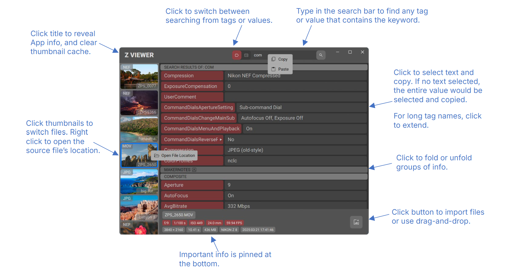
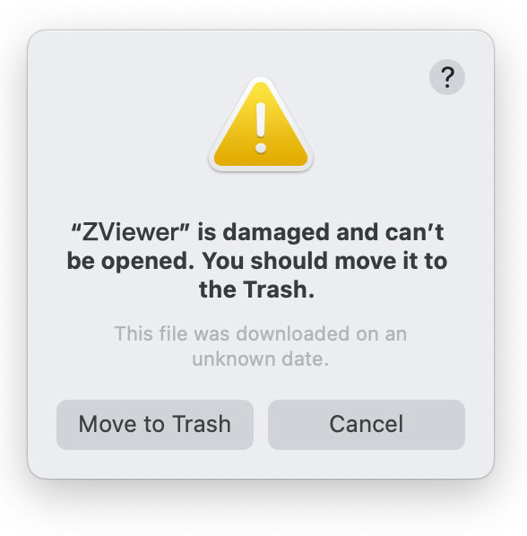
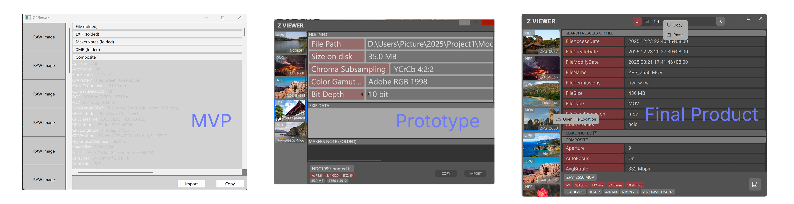
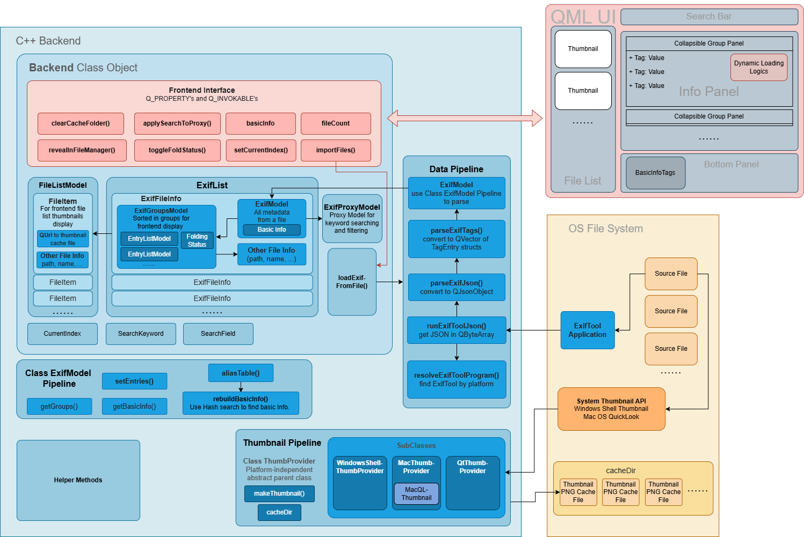

<h1 align="center">
  
  <br>
    Z Viewer
</h1>

<h3 align="center">
A Metadata Viewer for Multi-media Files and More. 
<br>
Based on <a href="https://exiftool.org/">ExifTool By Phil Harvey</a>.
</h3>

## Introduction
Z Viewer is a metadata viewer for multi-media files [and more](https://exiftool.org/#supported). It is a free, open source, cross platform desktop application developed with C++ and Qt QML. <br>
It is designed for content creators who want to check metadata of media files. For example, photographers may want to check exposure settings and codec of video footages as a reference for post-production. These metadata are encoded in the files, but different manufacturers have different formats, thus operating system file managers and editing software may not be able to display them. <br>
Z Viewer provides a simple and modern graphic user interface, allowing users to leverage the power of [ExifTool](https://exiftool.org/) without dealing with the abstract of command-lines. It also provides thumbnails, keyword searching, drag-and-drop, and other features to make the workflow more intuitive and efficient.<br>

## Features
- Supports [a large amount of file formats](https://exiftool.org/#supported), including .JPG, .NEF, .MOV, .CR3, and most other camera footages. 
- Use file dialog or drag-and-drop to import files. 
- Thumbnail views for imported files. Implemented with operating system APIs. 
- Open source file location by right-click menu. 
- Metadata information displayed in foldable groups. 
- Keyword searching. 
- Important information (aperture, ISO, etc. ) pinned at the bottom panel. Implemented with Hash search algorithm. 
- Built with modern UI design aiming for simplicity. Self-developed custom QML UI components to achieve a unified design language. 
- Developed with performance optimization in mind. C++ backend data structures and algorithms, and dynamic frontend resource loading for lower runtime costs. 
<p align="center">
  
</p>

## Install and Use
- #### Download the program:
   Z Viewer currently provides these pre-compiled release versions. Make sure to choose the proper version for your platform. 
  
  |Version  | Platform    |
  | ----------------------------------- | ------------------------------------- |
  |[Windows version](https://github.com/sdzzps/Z-Viewer/releases/download/v1.0.0/ZViewer_win_x86-64_1.0.0.zip)|PC with Windows 64-bit system |
  |[Mac OS x86 version](https://github.com/sdzzps/Z-Viewer/releases/download/v1.0.0/ZViewer_mac_x86-64_1.0.0.zip) |pre-2021 Mac with intel processors
  |[Mac OS ARM version](https://github.com/sdzzps/Z-Viewer/releases/download/v1.0.0/ZViewer_mac_arm64_1.0.0.zip)|post-2021 Mac with Apple Silicon|

  The application can also be compiled from [source code](https://github.com/sdzzps/Z-Viewer/archive/refs/tags/v1.0.0.zip) with Qt 6.10.1+, CMake, and MinGW.

- #### Unzip and save: 
  Unzip application folder and put it in a **writable** location, because the thumbnail cache will be saved in the application folder. **Do not** put it in read-only or system-protected locations. (For Windows users, **do not** put it in “Program Files /(x86)ˮ or similar.)

- #### Use the program: 
  For Windows version, double click **ZViewer.exe**; for Mac OS versions, double click **ZViewer.app**. If it shows the error notification, this is because [Gatekeeper](https://support.apple.com/en-us/102445) in Mac OS places unknown apps in quarantine by default. To remove quarantine, do **either one** of two following options: 
    1. Double click **Fix_ZViewer.command** in the same directory and grant required trusts and privileges; 
    2. [open Terminal](https://support.apple.com/guide/terminal/open-or-quit-terminal-apd5265185d-f365-44cb-8b09-71a064a42125/mac) in the directory of ZViewer.app, then run this command:  
    ```bash
    xattr -dr com.apple.quarantine ZViewer.app
    ```
    <p align="center">
    
    </p>
  Create shortcuts or links of above items and put them in Desktop or other locations for quick access. Avoid moving the executable file out from its original directory. <br>

  Some useful tips: 
  - When importing multiple files, the application may freeze for a while.
  - File list and metadata will be emptied after quitting the application.
  - The search function gives results with exact match of the keyword.
  - To clear thumbnail cache after using the app, click the title button to show App info, and click “Clear cache and quitˮ button. 
  
  Z Viewer is based on [ExifTool](https://exiftool.org/). For release versions of Z Viewer, a copy of ExifTool program is pre-installed in its tools directory: 
  |Version  | Platform    |
  | ----------------------------------- | ------------------------------------- |
  |Windows version|“…\ZViewer\toolsˮ|
  |Mac OS versions|“…/ZViewer.app/Contents/Resources/toolsˮ|
<br>
  For a self-compiled Z Viewer program, users need to manually put a copy of ExifTool in tools directory. <br>
  Users can also upgrade the ExifTool program by replacing its files in tools directory with newer releases from [the official website](https://exiftool.org/).
<br>
  When Z Viewer is unable to locate the built-in ExifTool, it will try using ExifTool from the system PATH, if exists, as a fallback. <br>

## Technical Overview
  This part is purposed as notes for the project’s future development. Although it is made public along with the rest of the project repository, I highly doubt anyone should self-torture by reading it, given its length and tediousness. If you are bored enough, just like me, and want to dive deeper into the technical details of this project, here is where we start. <br>

#### Design and Prototype
  The core idea behind the Z Viewer project is to create a modern, simple, and reliable tool for viewing metadata. The basic framework of UI, which consists of File Thumbnails List on the left, and Info Panel on the right, is decided before building the minimum viable product. After that, a design prototype is drawn. Flat visual style and color scheme of crimson and dark grey are chosen. Because metadata already carries a high density of textual information, we chose to replace text with icons wherever possible in the user interface. <br>

  <p align="center">
    
  </p>

#### Architecture

  <p align="center">
    
  </p>
The Z Viewer application consists of 3 major parts in development: Data Pipelines and Models, Thumbnail Pipelines, and UI Modules. 

#### Data Pipelines and Models

  The data pipelines use QProcess to invoke the ExifTool application. The output string is parsed into JSON, then custom data structures. <br>
  Backend class is the interface of communication to the QML frontend. It also stores and manages objects of imported data. To ensure maintainability, all Q_PROPERTY and Q_INVOKABLE exposed to the QML frontend are consolidated into the Backend class, instead of directly exposing other class methods. <br>
  Because QML frontend relies on List Models to display lists of items, multiple subclasses of QAbstractListModel are implemented. ExifModel stores the metadata in full. It also contains the methods of searching for the basic info (such as ISO and aperture) displayed in the Bottom Panel. This is implemented with hash searching to achieve minimal time complexity.  ExifModel objects also contain all the information required to rebuild other frontend models.  ExifGroupsModel and EntryListModel objects are constructed from ExifModel object data. ExifGroupsModel contains multiple EntryListModel, each representing a group of metadata, for Info Panel display. ExifGroupsModel also keeps track of the folding status of each group’s Collapsed Panel.  These models store information on a single file level and are stored in ExifFileInfo struct. A vector of ExifFileInfo (ExifList) is stored as private member of Backend class. <br>
  FileListModel stores the information on the file list level, which is all imported files in current session. Its purpose is for the frontend thumbnail panel. It can be reconstructed from ExifList. <br>
  Keyword searching functions are implemented with the ExifProxyModel class, which is inherited from the QSortFilterProxyModel class. It is a single instance stored in Backend class and always linked to the ExifModel of current file. <br>

#### Thumbnail Pipelines

  To achieve maximum file format compatibility, Z Viewer uses the thumbnail API provided by the operating system to load thumbnails in the File List. A virtual base class ThumbProvider is first implemented for cross-platform compatibility, and the implementations for platform-specific ThumbProvider subclasses are inherited from it. <br>
  The thumbnail pipelines for Windows system are based on IShellItemImageFactory. It requests HBITMAP object from the system API and converts it to QImage and then saves it to the cache folder on local disk. Because COM must run on the same thread, it is initialized in every function call instead of one fixed instance for all. <br>
  The thumbnail pipelines for Mac OS are based on QuickLookThumbnailing. Its core implementation is Objective-C++, written in a separate MacQLThumbnail file from MacThumbProvider class. <br>

#### UI Modules

  Custom QML modules are implemented for cross-platform UI visual consistency. ZBorderlessWindow is a custom borderless application window module with basic controls and resizing functions. CollapsedPart is the UI module holding a group of information and can be folded by clicking the title bar. The dynamic loading mechanism for scrolling provided by QML ListView does not handle delegates with inconsistent heights well, so custom dynamic loading logics are implemented with JavaScript by using the element heights provided by backend models, adding the scrolling position, and comparing it to the frontend viewport size.  Because different operating systems render text in different DPI, platform scaling factors are set to achieve UI consistency. 


## Acknowledgments
Z Viewer is based on the renowned open source project [ExifTool by Phil Harvey](https://exiftool.org/). 
Z Viewer is developed using Qt Quick (QML) and C++, using IDEs Qt Creator community version and Visual Studio community version. The project toolchain also includes CMake, MinGW, VS Code. AI services including ChatGPT, Google Gemini, and DeepSeek are used to assist project development. 
Fonts used in the UI: [Inter](https://fonts.google.com/specimen/Inter), [Roboto](https://fonts.google.com/specimen/Roboto), [Source Han Sans](https://github.com/adobe-fonts/source-han-sans). 
Icons used in the UI: [Material Symbols & Icons](https://fonts.google.com/icons).

Many thanks to JZ and Yang H. for providing technical insights and feedback during the development of this project. <br>
Thanks to WHJ for the help in compiling the Mac OS ARM release version. <br>
Thanks to Kai Taisa for providing sample images for testing. 


## License

Z Viewer 1.0.0 (released on 2025-12-27) is licensed under the Creative Commons Attribution-NonCommercial-ShareAlike 4.0 License (CC BY-NC-SA 4.0).

You are free to use, modify, and share this software for non-commercial purposes, as long as you credit the author [**sdzzps**](https://github.com/sdzzps) and distribute derivative works under the same license.

Commercial use of Z Viewer or derivative works is prohibited without prior written authorization from the author.
  #### Commercial Licensing

  If you wish to use Z Viewer or any derivative work in a commercial product or service, you must obtain a separate commercial license from the author.


  For commercial licensing inquiries, please contact us by [submitting an issue](https://github.com/sdzzps/Z-Viewer/issues). 
